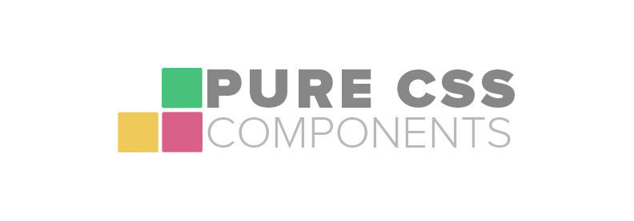

A set of common UI Components using the power of CSS and without Javascript.

[View the project](http://www.felipefialho.com/css-components) |
[Download the zip](http://www.felipefialho.com/css-components/build/css-components.zip)

## Components

* [Carousel](http://www.felipefialho.com/css-components/#component-carousel "Carousel")
* [Collapse](http://www.felipefialho.com/css-components/#component-collapse "Collapse")
* [Dropdown](http://www.felipefialho.com/css-components/#component-dropdown "Dropdown")
* [Modal](http://www.felipefialho.com/css-components/#component-modal "Modal")
* [Tab](http://www.felipefialho.com/css-components/#component-tab "Tab")
* [Tooltip](http://www.felipefialho.com/css-components/#component-tooltip "Tooltip")

## Contributing

Please read this [Coding Style](https://github.com/LFeh/coding-style/) for [Issues](https://github.com/LFeh/css-components/issues), pull requests and coding standards.

All changes must be made in `/dev` folder. The CSS should be modified using the **LESS** preprocessor.

### Getting Started

```bash

# 1. Fork this repository and clone it into the current directory
git clone https://github.com/<your-username>/css-components.git

# 2. Navigate to the newly cloned directory
cd css-components

# 3. Install the dependencies
npm install

```

### Development

```bash

# For start the server, watching your .less files changes and compile CSS
grunt w

```

### Pull Requests

```bash

# Build the project for deploy and compress zip files
grunt build

# View your project release in GhPages
https://<your-username>.github.io/css-components/

# Open your Pull Request

```

## License

[MIT License](http://felipefialho.mit-license.org/) © Luiz Felipe Tartarotti Fialho
