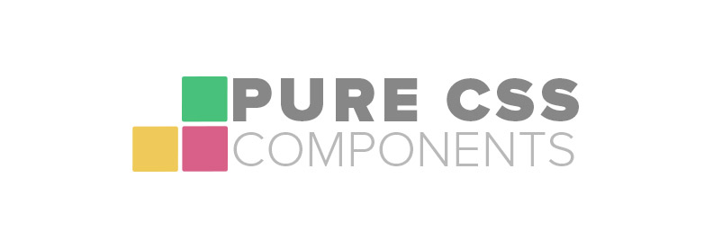

# Pure CSS Components

[](https://app.netlify.com/sites/css-components/deploys)
[](./license.md)

> UI components built with HTML and CSS only. Zero JavaScript, in 2014 and today.

**[See the components](https://css-components.felipefialho.com)** · [Why](https://css-components.felipefialho.com/why/)

In 2014, a modal, a carousel or a set of tabs meant a jQuery plugin. This project built them with no JavaScript at all, storing their state in hidden checkboxes, radio buttons and the URL hash. A lot of people shipped them to production.

Twelve years later, the browser does it natively. `<details>`, `<dialog>`, invoker commands, the Popover API, anchor positioning and CSS carousels turned those hacks into real, accessible platform features. So the idea is relevant again, and the site now shows both sides.

## What's inside

### Then and now

Each of the six original components, working as it was written in 2014, next to the way HTML and CSS build it natively today.

| Component | 2014 | Today |
| --- | --- | --- |
| [Carousel](https://css-components.felipefialho.com/#carousel) | Radio inputs + labels | `scroll-snap`, `::scroll-button()`, `::scroll-marker` |
| [Collapse](https://css-components.felipefialho.com/#collapse) | Hidden checkbox / radios | `<details name>`, `::details-content` |
| [Dropdown](https://css-components.felipefialho.com/#dropdown) | Hidden checkbox, `:hover` | Popover API, anchor positioning, `interestfor` |
| [Modal](https://css-components.felipefialho.com/#modal) | Hidden checkbox | `<dialog>`, `commandfor`, `@starting-style` |
| [Tab](https://css-components.felipefialho.com/#tab) | Radio inputs | Exclusive `<details name>` laid out as tabs |
| [Tooltip](https://css-components.felipefialho.com/#tooltip) | `:hover` + `::after` | `popover="hint"`, `interestfor`, anchor positioning |

### Born native

Components with no 2014 version. No hidden input could fake them, and until recently each one needed a script.

- [Custom select](https://css-components.felipefialho.com/#select): `appearance: base-select`, `::picker(select)`
- [Switch and segmented control](https://css-components.felipefialho.com/#switch): `<input switch>`, `:has()`
- [Smarter forms](https://css-components.felipefialho.com/#forms): `field-sizing: content`, `:user-invalid`
- [File tree](https://css-components.felipefialho.com/#tree): nested `<details>`
- [Filters drawer](https://css-components.felipefialho.com/#drawer): `<dialog closedby>`, invoker commands
- [Sticky header](https://css-components.felipefialho.com/#header): scroll-state container queries
- [Scroll-spy table of contents](https://css-components.felipefialho.com/#toc): `scroll-target-group`, `:target-current`
- [Reading progress](https://css-components.felipefialho.com/#progress): scroll-driven animations
- [Radial menu](https://css-components.felipefialho.com/#radial): `sibling-index()`, `sibling-count()`
- [Gallery](https://css-components.felipefialho.com/#gallery): cross-document view transitions

Some of these features are new. Every exhibit lists where it works today, and browsers without support get a plain version that still works.

## Principles

- **Zero JavaScript.** Not in the components, not on the site. It works with JavaScript turned off.
- **Honest support.** Every native feature shows its real browser support.
- **Progressive enhancement.** New features sit behind `@supports`, so nothing breaks where they are missing.
- **Accessible by default.** The native versions use real elements with focus, keyboard and screen reader support built in.

## Using the code

Each component shows its HTML and CSS on the site, ready to copy. The 2014 originals are kept for history: if you are building something today, use the native versions.

The original Stylus sources and zip downloads are in the [v2.0.0 release](https://github.com/felipefialho/css-components/releases/tag/v2.0.0).

## Running locally

Requires Node.js 22.12+ and [pnpm](https://pnpm.io/). Built with [Astro](https://astro.build/).

```sh
pnpm install
pnpm dev
```

- `pnpm dev`: start the dev server
- `pnpm build`: type-check and build to `dist`
- `pnpm lint`: lint scripts and styles

Each component lives in its own folder:

- `src/exhibits/<name>/then.*`: the 2014 original
- `src/exhibits/<name>/now.*`: the native version
- `src/exhibits/born/<name>/demo.*`: born native components

## Support

If this project helped you, back then or today, you can [sponsor my work on GitHub](https://github.com/sponsors/felipefialho).

## License

MIT License © Felipe Fialho
